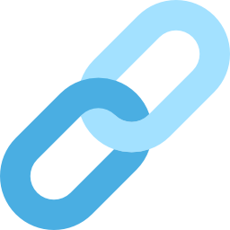

<div align="center">
  
  <h1>ForgeLink</h1>
  <p> Cold emails that warm up: from research to relationships.</p>
</div>

<details>
  <summary>Table of Contents</summary>
  <ol>
    <li>
      <a href="#about-the-project">About The Project</a>
      <ul>
        <li><a href="#built-with">Built With</a></li>
        <li><a href="#demo">Built With</a></li>
        <li><a href="#features">Built With</a></li>
        <li><a href="#color-codes">Built With</a></li>
        <li><a href="#project-structure">Built With</a></li>
      </ul>
    </li>
    <li><a href="#getting-started">Getting Started</a></li>
    <li><a href="#contributors">Contributors</a></li>
    <li><a href="#contact">Contact</a></li>
    <li><a href="#acknowledgments">Acknowledgments</a></li>
  </ol>
</details>

## About The Project

### Built with

[![Next][Next.js]][Next-url]
[![React][React.js]][React-url]
[![Javascript][Javascript.js]][Javascript-url]
[![CSS][CSS.com]][CSS-url]
[![HTML][HTML.com]][HTML-url]
[![Python][Python.com]][Python-url]
[![Gemini][Gemini.com]][Gemini-url]

### Demo

[](https://www.youtube.com/watch?v=5VW6-MmL4uU)

### Features

- **Profile summary:**  
  BrowserUse → collects text + sources → Gemini extracts 5–10 concise facts (roles, companies, skills, notable work).

- **Auto-intent drafting:**  
  No dropdown needed. The server classifies your prompt into one of:

  - **Email** (subject + body)
  - **Questions** (3–6 tailored questions)
  - **Message** (short DM/intro)
  - **Summary** (talking points)

- **Grounded generation:**  
  Gemini receives the target’s facts, sources, best URL, and a clipped profile excerpt, plus overlap reasoning with your profile so that drafts stay specific.

- **Chat UX built for flow:**

  - System intro bubble at the top with profile highlights.
  - Thinking bubble while Gemini drafts.
  - Clean, copy-ready results.

- **Targets sidebar (organized outreach):**  
  Stacked list of people you’ve researched; add from the enter-info page, click to open chat, and delete via a trash icon.

- **Simple auth & security:**  
  JWT signup/login; all targets and actions are bound to the authenticated user (no IDs passed in requests).

- **Data model (MongoDB Atlas):**

  - **Users:** username, passwordHash, name, headline, (optional) experiences, interests, tone
  - **Targets:** ownerUserId, name, headline, facts, sources, profileUrl, profileText, confidence
  - **Drafts:** ownerUserId, targetId, subject/body or questions

- **Dev-friendly setup:**  
  React + Vite, Express, Nodemon, `.env` config, robust JSON parsing for LLM outputs, and CORS enabled for local dev.

### Color codes


### Project Structure

```yaml
FORGELINK/
├── node_modules/
├── python/.venv
├── public/
│   ├── main.jsx
│   ├── styles.css
│   └── assets/
│       ├── icon.png
├── scripts/
│   ├── collect_profile.py
│   └── seed_user.js
├── server/
│   ├── middleware/
│   │   └── requireAuth.js
│   ├── models/
│   │   └── User.js
│   ├── routes/
│   │   ├── auth.js
│   │   └── targets.js
│   ├── services/
│   │   └── ai.js
│   └── server.js
├── src/
│   ├── components/
│   │   ├── Button.jsx
│   │   ├── Message.jsx
│   │   └── Sidebar.js
│   ├── pages/
│   │   ├── Chat.jsx
│   │   ├── EnterInfo.jsx
│   │   ├── Login.jsx
│   │   └── SignUp.jsx
│   ├── styles/
│   │   ├── Chat.css
│   │   ├── EnterInfo.css
│   │   ├── Login.css
│   │   ├── Sidebar.css
│   │   └── SignUp.css
│   ├── utils/
│   │   ├── api.js
│   │   ├── auth.js
│   │   └── targets.js
│   ├── App.jsx
│   ├── App_test.jsx
│   ├── index.html
│   └── index.jsx
├── .env
├── .gitignore
├── nodemon.json
├── package-lock.json
├── package.json
├── README.md
└── vite.config.js
```

## Getting Started

1. Create a MongoDB atlas account [here](https://www.mongodb.com/cloud/atlas/register)

2. Download dependencies in npm:

```bash
npm init -y
npm i react react-dom react-router-dom cors express mongoose @google/generative-ai bcryptjs jsonwebtoken
npm i -D vite @vitejs/plugin-react concurrently
```

3. Create virtual env in root directory (ForgeLink)

```bash
python3 -m venv python/.venv
source python/.venv/bin/activate
```

4. Download dependencies with pip:

```bash
pip install browser-use python-dotenv playwright
python -m playwright install --with-deps chromium

```

5. In .env:

```bash
PORT=3000
GOOGLE_API_KEY=""
MONGODB_URI=""
NODE_ENV=development
PYTHON_BIN=python/.venv/bin/python
JWT_SECRET=
VITE_API_BASE=
```

6. Kickstart ForgeLink

```bash
npm run dev
```

Then open `http://localhost:5173/`!

> API will be hosted at port 3000

## Contributors

| Team member | Roles                                                                                                     |
| ----------- | --------------------------------------------------------------------------------------------------------- |
| Vienna      | BrowserUse, Gemini, linking backend and frontend, authentication, Login/Sign up logic, chat page, sidebar |
| Angela      | Designs and aesthetics for pages, login and sign up pages, EnterInfo page                                 |

## Contact

Vienna Zhao - [GitHub](https://github.com/vienna601) - [LinkedIn](https://www.linkedin.com/in/vienna-zhao-207b402b5/) - [vienna.sw.chiu@gmail.com](vienna.sw.chiu@gmail.com)

Angela Ho - [GitHub](https://github.com/Angelaho1128) - [LinkedIn](https://www.linkedin.com/in/angela-ho-a08a10304/) - [hocheukwing1128@gmail.com](hocheukwing1128@gmail.com)

Project Link: https://github.com/Angelaho1128/ForgeLink

## Acknowledgements

[Flaticon](https://www.flaticon.com/)

[Readme Template 1 - othneildrew](https://github.com/othneildrew/Best-README-Template)

[Readme Template 2 - Louis3797](https://github.com/Louis3797/awesome-readme-template?tab=readme-ov-file)

[Next.js]: https://img.shields.io/badge/next.js-000000?style=for-the-badge&logo=nextdotjs&logoColor=white
[Next-url]: https://nextjs.org/
[React.js]: https://img.shields.io/badge/React-20232A?style=for-the-badge&logo=react&logoColor=61DAFB
[React-url]: https://reactjs.org/
[Javascript.js]: https://img.shields.io/badge/JavaScript-F7DF1E?style=for-the-badge&logo=javascript&logoColor=000
[Javascript-url]: https://developer.mozilla.org/en-US/docs/Web/JavaScript
[CSS.com]: https://img.shields.io/badge/CSS-639?style=for-the-badge&logo=css&logoColor=fff
[CSS-url]: https://developer.mozilla.org/en-US/docs/Web/CSS
[HTML.com]: https://img.shields.io/badge/HTML-%23E34F26.svg?style=for-the-badge&logo=html5&logoColor=white
[HTML-url]: https://developer.mozilla.org/en-US/docs/Web/HTML
[Python.com]: https://img.shields.io/badge/python-3670A0?style=for-the-badge&logo=python&logoColor=ffdd54
[Python-url]: https://www.python.org/
[Gemini.com]: https://img.shields.io/badge/Google%20Gemini-886FBF?style=for-the-badge&logo=googlegemini&logoColor=fff
[Gemini-url]: https://ai.google.dev/gemini-api/docs
